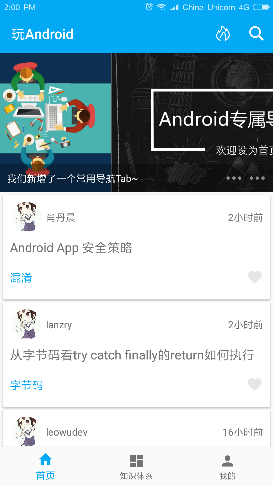

# WanAndroid
Try to build a www.wanandroid.com client

#  APK
[WanAndroid_v1.0_20180212.apk](https://coding.net/u/salecoding/p/WanAndroid/git/raw/master/app/release/WanAndroid_v1.0_20180212.apk)

# 接口
[玩Android接口](http://www.wanandroid.com/blog/show/2)

# 代码结构
### MVP + RxJava + Retrofit2 + Dagger2 + Glide
* [RxJava2](https://github.com/ReactiveX/RxJava)
* [Dagger2](https://github.com/google/dagger)
* [Retrofit2](https://github.com/square/retrofit)
* [鸿神的Flowlayout](https://github.com/hongyangAndroid/FlowLayout)
* [BRVAH](https://github.com/CymChad/BaseRecyclerViewAdapterHelper)
* [Agentweb](https://github.com/Justson/AgentWeb)
* [Glide](https://github.com/bumptech/glide)

# 项目运行截图

# 参考项目
WanAndroidClient https://github.com/wangzailfm/WanAndroidClient

微阅 https://github.com/Will-Ls/WeiYue

非常感谢以上开源项目的作者！谢谢！

[Coding](https://coding.net/u/salecoding/project) 
